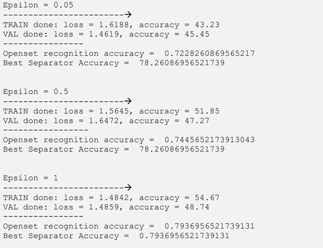
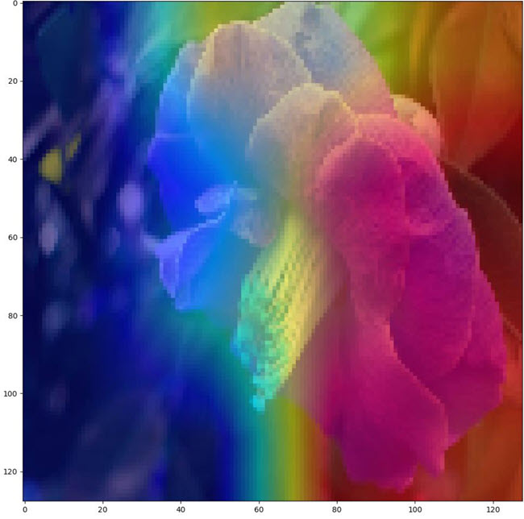

# Privacy-Interpretability-102-flowers-data

## Decription:
In this phase first we add differential privacy to each part of our proposed structure and 
report the results of it. After that we try to interpret each part and show the output.
First we implement the epsilon-differential privacy for first block. We do this job by using 
opacus library. To do it, we first use module validator to fix the layer that are not compatible 
with privacy. After that we initialize a privacy engine and pass data_loader, optimizer and 
model into it. We set the epsilon parameter in desired range and the accuracy of first part of 
model is as follow:

  

For the interpretability, we create interpretations of the open set recognizer, that is the 
part that detects closed set classes and whether the data is in the opens et or not. The 
clustering part is intrinsically interpretable because it works directly based on the 
extracted features of the deep model. So, we apply post-hoc interpretation on the deep 
model to visualize important parts of the image that makes the model decide.
We use CAM-based interpretation here. Model first detects if the sample is in the open set 
or not, if it’s not, interpretation is applied based on the predicted class. If the sample is in 
the open set, the area in the image that is not important in the detection of any of the closed 
set classes is shown. It may contain meaningless areas in the image. But because from 
model’s perspective, open set is ANYTHING outside the closed set domain, meaningless 
areas are also parts of the image that are seen as open set.
Here is a visualization of model output based on GradCAM that is in the closed set:

  

The interpreter is able to work with the following CAM-based algorithms:
GradCAM, 
GradCAMPlusPlus,
AblationCAM,
XGradCAM,
EigenCAM,
FullGrad.
 The sample runnable script is test_interpretability.py that has also a notebook version 
alongside

